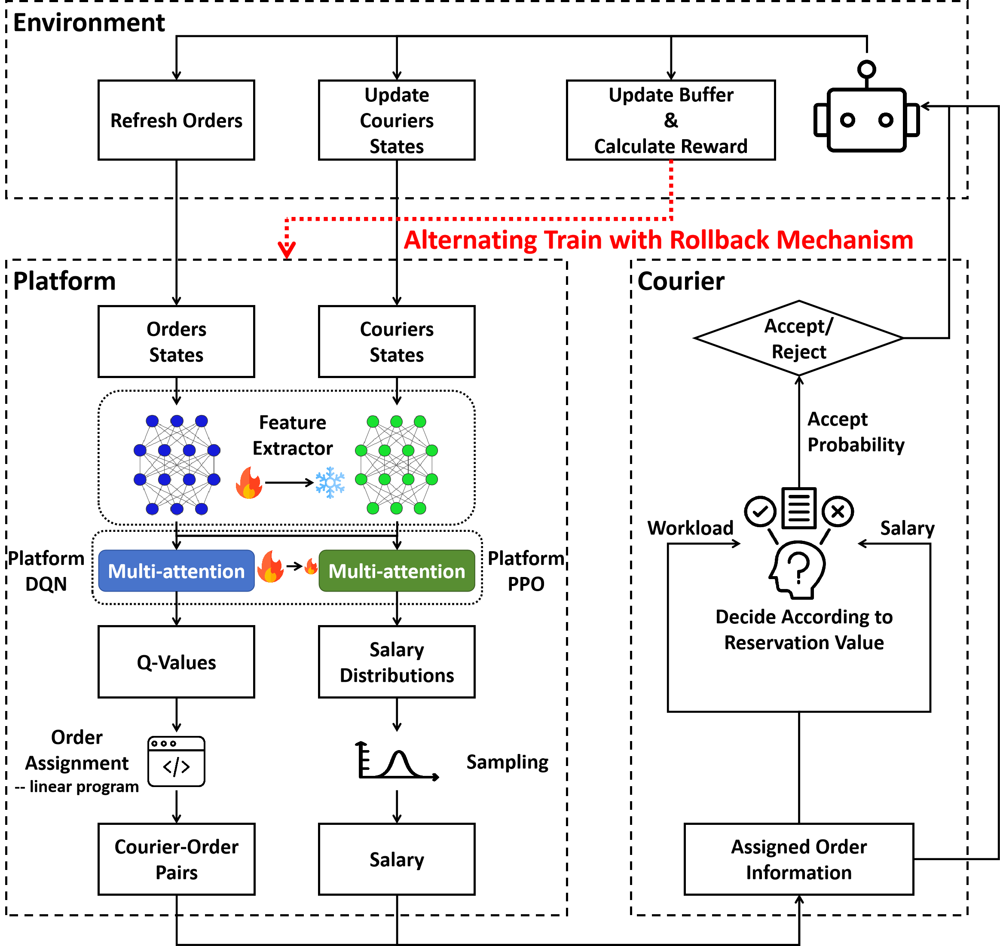
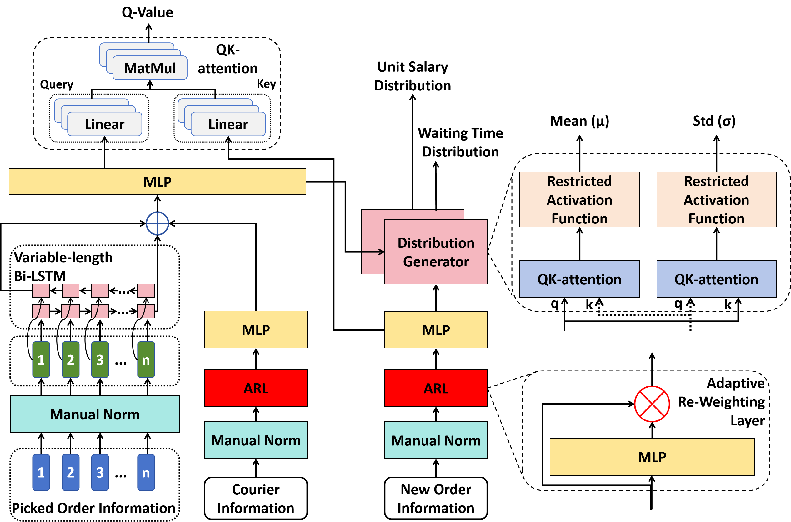
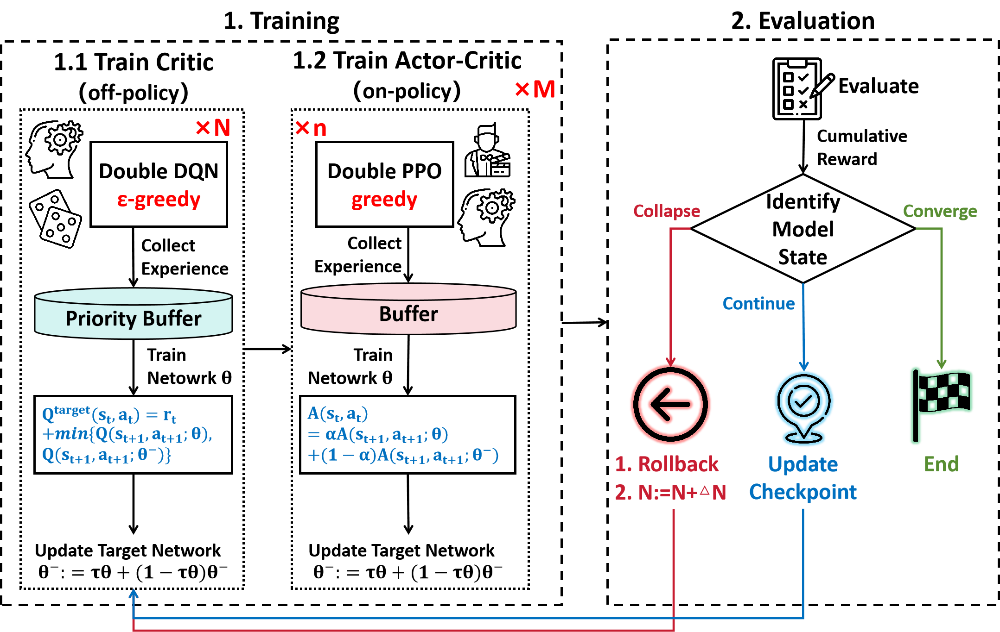

# Double PDF

**Article:** Zijian Zhao, Sen Li*, "Discriminatory Order Assignment and Payment-Setting on Food-Delivery Platforms: A Multi-Action and Multi-Agent Reinforcement Learning Framework" (under review, Transportation Research: Part C)

**Acknowledgement:** Some parts of the code is based on the work of [‪Yulong Hu‬‬](https://scholar.google.com/citations?user=IfVrhp0AAAAJ&hl=zh-CN&oi=ao).


## 1. Workflow










## 2. Dataset 

Due to copyright restrictions, we cannot provide the data used in this paper. However, we offer a brief introduction to the data format so you can utilize our code with your own dataset.

Our dataset consists of one hour of food delivery data in Hong Kong, China, containing approximately 10,000 records. It is saved in a CSV file, where each column represents an attribute and each row corresponds to an order. The relevant attributes include:

1. **dlat**: Latitude of the destination
2. **dlon**: Longitude of the destination
3. **plat**: Latitude of the origin
4. **plon**: Longitude of the origin
5. **minute**: The minute at which the order is placed

As you can see, there is no ground truth for salary information. Therefore, we simply set the reservation value to range from 0.85 to 1.15, without a specific unit.


## 3. How to Run

### 3.0 Prepare

To run our code with your own dataset, you need to make some additional configurations:

1. Run the Docker container for [OSRM](https://github.com/Project-OSRM/osrm-backend) (be sure to download the corresponding PBF file for your city).
2. Modify the hyper-parameters in the `norm` function within `Worker.py` (we provide explanations in the comments). You can adjust these to suitable values for your environment. For simplicity, you can also modify the function to return the input directly, although this may affect model performance.


### 3.1 Pre-train

```shell
python main.py --probability_worker --bilstm --mode <1: different reservation values, speed, capacity; 2: only different reservation values> --train_times <training epochs after each episode> --reward_threshold <threshold to detect model collapse> --actor_episode <number of continuous episodes to train DQN> --critic_episode <number of continuous episodes to train PPO> --eval_episode <frequency of model evaluation> --freeze_episode <when to freeze the feature extractor> --demand_path <path to your order data> --zone_table_path <path to valid zone table>
```

Please note that the `zone_table_path` is optional. We use it to ensure valid initial positions for each courier, but you can omit it and set random initial positions instead.


### 3.2 Fine-tune

```shell
python main.py --probability_worker --bilstm --mode <1: different reservation values, speed, capacity; 2: only different reservation values> --train_times <training epochs after each episode> --reward_threshold <threshold to detect model collapse> --actor_episode <number of continuous episodes to train DQN> --critic_episode <number of continuous episodes to train PPO> --eval_episode <frequency of model evaluation> --freeze_episode <when to freeze the feature extractor> --demand_path <path to your order data> --zone_table_path <path to valid zone table> --platform_model_path <path to pre-trained model parameters>
```


### 3.3 Eval

```shell
python eval.py --probability_worker --bilstm --mode <1: different reservation values, speed, capacity; 2: only different reservation values> --eval_times <number of episodes for evaluation> --demand_path <path to your order data> --zone_table_path <path to valid zone table> --platform_model_path <path to model parameters>
```


## 4. Citation

```

```

